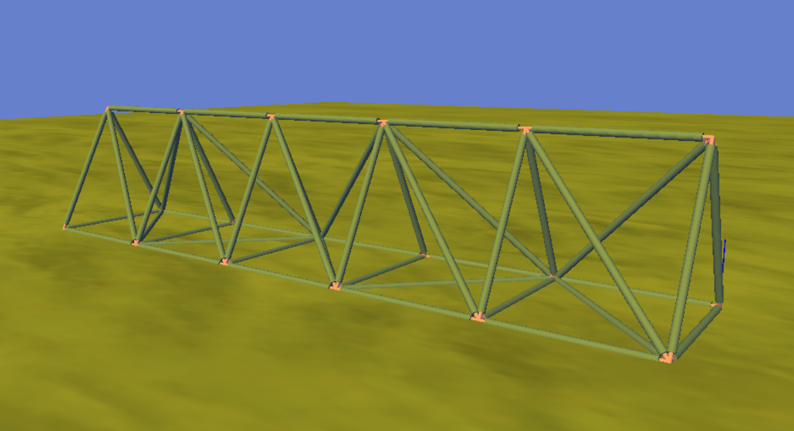

# Frame3dd Sample Models for Sustainable Building Modeler (SBM)

This folder contains a collection of Lua scripts designed for the [Sustainable Building Modeler (SBM)](https://www.sbm.one/home), replicating structural examples from the [Frame3DD](http://frame3dd.sourceforge.net/) documentation.

Each script programmatically generates a 3D structural frame model inside SBM. These models are compatible with the included `Frame3DDConverter.lua`, which exports the structure to a `.3dd` file format usable by Frame3DD for structural analysis.

---

## 📦 Contents

- `Example A - Simple Beam.lua`
- `Example B - 2D Portal Frame.lua`
- `Example C - Tetrahedral Frame.lua`
- `Example D - 3D Tower.lua`
- *(... other Frame3DD-based examples ...)*

---

## 🚀 How to Use

### 1. **Load a Script in SBM**
Open one of the scripts (e.g., `Example C - Tetrahedral Frame.lua`) in SBM’s Lua editor and run it. This will create the corresponding 3D model in the modeling environment.

### 2. **Ensure Structural Catalogs are Available**
Before running the scripts, make sure that the **structural profile catalogs** used by the models are present in your **User Palette**.

📌 *Most scripts mention which catalogs are required at the top in comments.*

To do this:

- Add the required structural catalogs to your **User Palette**
- Use **“Update User Palette”** from SBM’s UI

### 3. **Convert the Model to Frame3dd**
Use the converter script:

📎 [Frame3DDConverter.lua](https://github.com/sahandt/SBM-Scripts/blob/master/Converters/Frame3DDConverter.lua)

This will export the current SBM model to a `.3dd` file.

### 4. **Run Frame3dd Analysis**
Download and run Frame3DD (available [here](http://frame3dd.sourceforge.net/)) and load the generated `.3dd` file for analysis.

---

## 🖼 Screenshot

Below is the rendered result of the script:

### **Example C – Tetrahedral Frame**

> *(Upload your screenshot with this exact filename for the image to show)*

---

## 🧰 Requirements

- Sustainable Building Modeler (latest version)
- [Frame3DD](http://frame3dd.sourceforge.net/)
- Required structural catalogs (W sections, pipes, angles, etc.)

---

## 📚 References

- [Frame3DD Documentation](http://frame3dd.sourceforge.net/)
- [SBM Scripting Guide](https://www.sbm.one/home)

---

## 📜 License

MIT License – © Sahand Tashak
This repository and its contents are shared for educational and structural analysis automation purposes.
